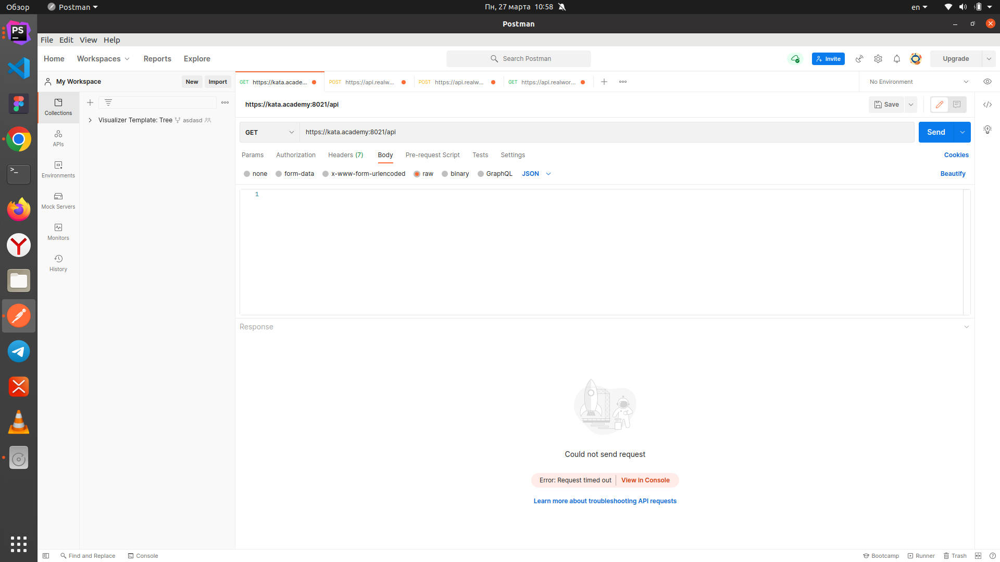
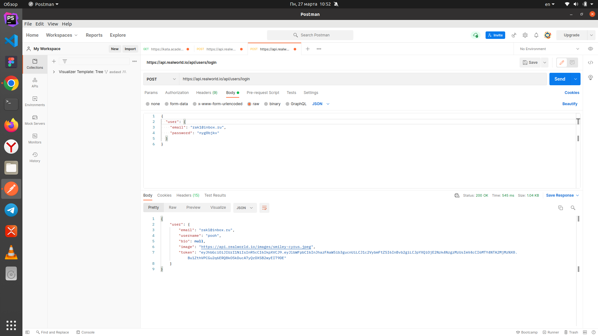
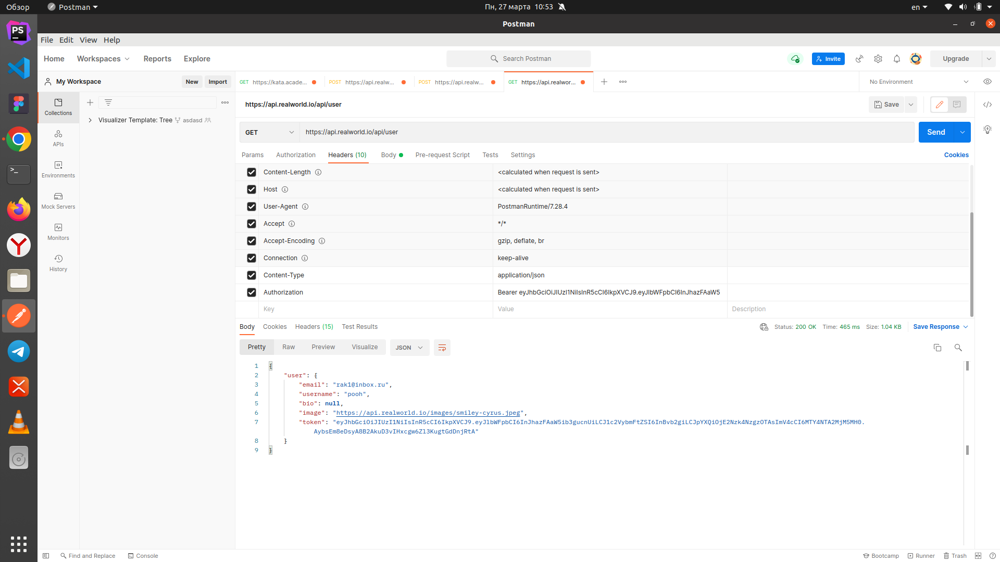
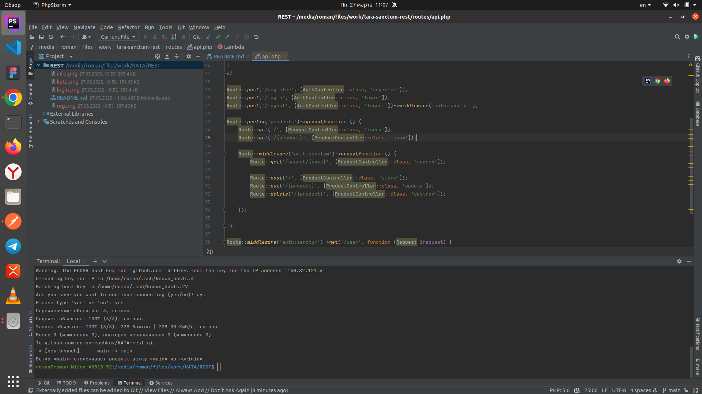

# KATA-rest

1. У вас не работает Апи

2. Сделал все на эндпоинты realworld

    2.1. Регистрация
   

   2.2. Логин
   

   2.3. Информация
   

3. Что такое рест знаю и понимаю. С бэком хорошо знаком, сам пишу

